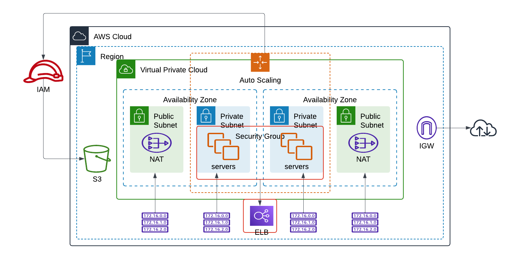

# Deploy application using CloudFormation

This project automates the deployment of the application on AWS using Infrastructure as Code (IaC) with AWS CloudFormation. The infrastructure is divided into separate stacks: one for the network setup and one for the application deployment. The goal is to provision, configure, and tear down the necessary infrastructure with ease.

# Infrastructure Diagram

**Project Overview**

This project uses CloudFormation to provision the following resources:

- VPC with public and private subnets
- Load Balancer to handle HTTP/HTTPS traffic
- EC2 instances running the application
- S3 for static content storage
- CloudFront for content delivery
- IAM roles and policies for security

The deployment is divided into two independent stacks:

- Network Stack: Managed by the network team, this stack provisions VPCs, subnets, and security groups.

- Application Stack: Responsible for provisioning the application components, including EC2 instances, load balancers, S3, and CloudFront.

**Prerequisites**
- AWS account with appropriate permissions
- AWSCLI [Install awscli](https://docs.aws.amazon.com/cli/latest/userguide/getting-started-install.html) and configured
- CloudFormation templates for both the Network and Application stacks.
- Scripts to create, update, deploy and delete the stacks.

## Spin up instructions

To spin up your infrastructure using the provided scripts, follow the steps below:

1.  Make the script executable:

 `chmod +x <scripts.sh>`

2. Create a new stack:

- Use the create.sh script to create a new CloudFormation stack.
- The script requires three parameters (such as StackName, ParameterFile, and TemplateFile). You will need to pass these parameters as per the instructions in the script.

`./create.sh StackName ParameterFile TemplateFile`

- This script creates a new stack with the provided parameters. Make sure you include IAM capabilities

3. Update an existing stack:

`./update.sh StackName ParameterFile TemplateFile`

- This script will update the stack with new configurations based on the changes in the parameter or template file.

4. Deploy a stack:

`./deploy.sh StackName ParameterFile TemplateFile`

- The deploy.sh script checks if the stack already exists. If it does, the script will update the stack; if it doesn't, it will create a new stack. It very useful for automation like CI/CD pipeline

## Tear down instructions

To tear down the deployed resources, follow these instructions:

1. Delete a stack:

`./delete.sh StackName`

- Use the delete.sh script to delete a stack. The script only requires one parameter: the name of the stack you wish to delete.

## Other considerations
- Note:

Ensure that the network stack is deployed first since the application stack depends on the network resources (VPC, subnets, etc.).

## Website URL

- CloudFrontURL: https://d1gjuuten5htu8.cloudfront.net

- WebAppLBDNS: http://udagra-WebAp-mMkpfHQBWeXO-1923467063.us-east-1.elb.amazonaws.com
